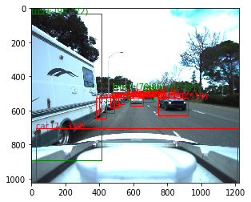
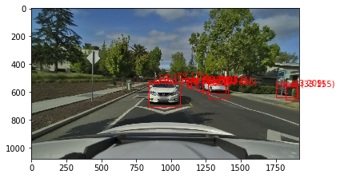
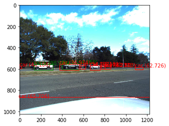
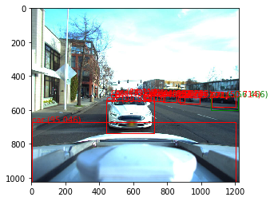
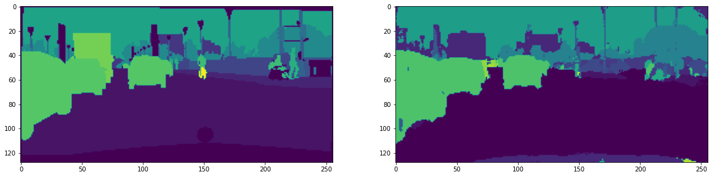
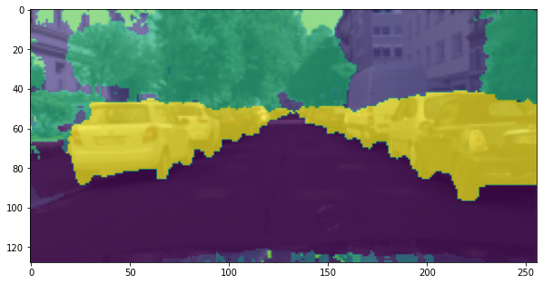
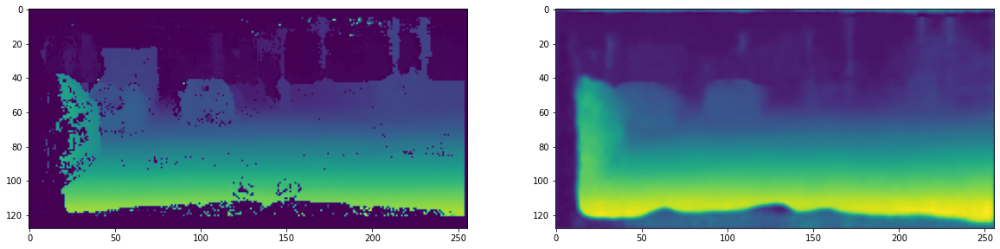
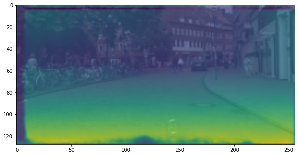

# Perception System for Autonomous Vehicles

Three computer-vision building blocks of a self-driving perception stack, each in its own Colab notebook:

| Notebook | Task | Method |
|---|---|---|
| `YoloV3_Project.ipynb` | 2D object detection | YOLOv3 assembled layer by layer in Keras and loaded with pretrained Darknet weights (COCO, 80 classes) |
| `DeepSort_Project1.ipynb` | Multi-object tracking in video | YOLOv3 detections + Deep SORT: Kalman filter, Hungarian matching, cosine appearance metric |
| `MTAN_Project.ipynb` | Multi-task scene understanding | Multi-Task Attention Network (SegNet backbone) for joint semantic segmentation and depth estimation on Cityscapes |

     

## 1. Object detection - YOLOv3

- The network is defined from scratch in Keras (`make_yolov3_model`): Darknet-53 backbone with three detection heads at three scales.
- Pretrained Darknet weights (`yolov3.weights`, 237 MB) are parsed by a custom `WeightReader`, loaded into the Keras graph, and saved as `model.h5`.
- Input 416 x 416, COCO anchors, class threshold 0.3, non-max suppression at IoU 0.5.
- Outputs from the three scales are decoded, rescaled to the original image size, and drawn.

Detections on driving scenes (cars, buses, traffic lights, pedestrians):

| | |
|---|---|
|  |  |
|  |  |

## 2. Object tracking - Deep SORT

Extends the detector to video and assigns persistent IDs to objects across frames. The notebook walks through every Deep SORT component:

- **Detection** - YOLOv3 boxes per frame, each encoded with the `mars-small128` appearance-embedding network.
- **Kalman filter** - constant-velocity motion model over an 8-dimensional state (box centre, aspect ratio, height, and their velocities) predicting where each track will be next.
- **Association** - IoU matching plus a cosine nearest-neighbour metric (max distance 0.7), solved as a linear assignment problem with gating at the chi-square 0.95 quantile.
- **Track management** - tentative / confirmed / deleted track states, non-max suppression, per-ID colouring.

Each input clip (`challenge`, `harder_challenge`, `solidWhiteRight`, `solidYellowLeft`, `project_video`) is written back out as an annotated `.mp4`. The committed run was CPU-only, at roughly 6 seconds per frame.

## 3. Multi-task learning - MTAN

One network that predicts a semantic segmentation map and a depth map at the same time, following Liu, Johns and Davison, *End-to-End Multi-Task Learning with Attention* (CVPR 2019).

- **Backbone** - SegNet encoder-decoder (filters 64, 128, 256, 512, 512) with task-specific attention modules over the shared features.
- **Loss weighting** - Dynamic Weight Average (DWA), temperature 2.0, which rebalances the two task losses each epoch from their recent rates of change.
- **Training** - Cityscapes (preprocessed `.npy` images, labels, and depth), batch size 8, Adam at lr 1e-3, StepLR(step 100, gamma 0.5), 100 epochs.
- **Metrics** - mean IoU and pixel accuracy for segmentation, absolute error for depth.

Final epoch:

| Split | Segmentation loss | Mean IoU | Pixel accuracy | Depth abs. error |
|---|---|---|---|---|
| Train | 0.099 | 0.800 | 0.964 | 0.0080 |
| Test | 0.753 | 0.335 | 0.865 | 0.0163 |

| Segmentation: label (left) vs prediction (right) | Segmentation overlaid on the input |
|---|---|
|  |  |

| Depth: label (left) vs prediction (right) | Depth overlaid on the input |
|---|---|
|  |  |

## Repository contents

| File | What it is |
|---|---|
| `YoloV3_Project.ipynb` | YOLOv3 in Keras: model definition, weight loading, decoding, NMS, detections on images |
| `DeepSort_Project1.ipynb` | Deep SORT tracker on top of YOLOv3, run over video clips |
| `MTAN_Project.ipynb` | MTAN training and evaluation on Cityscapes, with segmentation and depth visualisations |
| `assets/` | Figures exported from the notebooks |

## Running it

Every notebook opens in Colab with the badges above. The YOLOv3 and Deep SORT notebooks download their weights with `wget` in the first cells. The MTAN notebook expects the preprocessed Cityscapes split from the official MTAN repository, unpacked to the path set in the "Dataset" cell.

## Limitations and next steps

- The MTAN train / test gap (mean IoU 0.80 vs 0.34) shows overfitting on the small preprocessed set. Augmentation, the full Cityscapes split, or early stopping would close it.
- Deep SORT here is CPU-bound. A lighter detector (YOLOv8n) or a GPU runtime would bring it to real time.
- Detection uses COCO weights without fine-tuning on driving data. Fine-tuning on KITTI or BDD100K would improve recall on small objects such as traffic lights and signs.
- The three modules run separately. Chaining them (detect, track, segment) into one pipeline is the next integration step.

## Acknowledgements

- YOLOv3 Keras construction and weight loading follow [experiencor/keras-yolo3](https://github.com/experiencor/keras-yolo3).
- Deep SORT components follow the reference implementation by Wojke et al. ([nwojke/deep_sort](https://github.com/nwojke/deep_sort)); the `mars-small128` encoder weights are from [anushkadhiman/ObjectTracking-DeepSORT-YOLOv3-TF2](https://github.com/anushkadhiman/ObjectTracking-DeepSORT-YOLOv3-TF2).
- MTAN model, DWA weighting, and the preprocessed Cityscapes data follow the official [lorenmt/mtan](https://github.com/lorenmt/mtan) repository.

## References

- Redmon and Farhadi, *YOLOv3: An Incremental Improvement*, 2018.
- Wojke, Bewley and Paulus, *Simple Online and Realtime Tracking with a Deep Association Metric*, ICIP 2017.
- Liu, Johns and Davison, *End-to-End Multi-Task Learning with Attention*, CVPR 2019.
- Cordts et al., *The Cityscapes Dataset for Semantic Urban Scene Understanding*, CVPR 2016.

## Author

**Diya Sharma** - [GitHub](https://github.com/diyasharma05) · [LinkedIn](https://www.linkedin.com/in/diya-sharma-6a2210272/)
